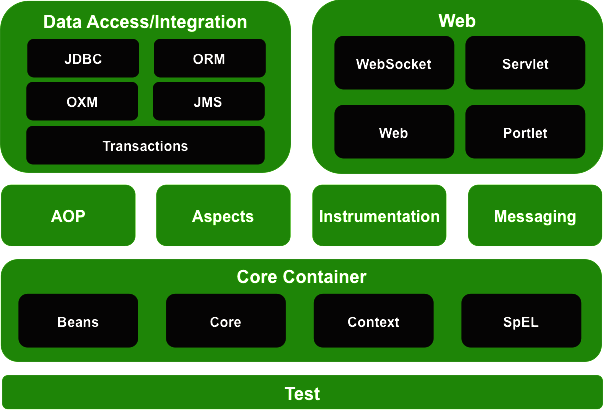

<link rel="stylesheet" href="https://zhmhbest.gitee.io/hellomathematics/style/index.css">
<script src="https://zhmhbest.gitee.io/hellomathematics/style/index.js"></script>

# [Spring Framework](../index.html)

[TOC]

## 概述

- 下载[Spring Framework](https://repo.spring.io/release/org/springframework/spring/)



**控制反转（Inversion of Control, IOC）**：通过**XML配置**、**工厂模式**和**反射**等技术，把对象创建和调用过程交给Spring进行管理，以降低耦合度。

**面向切面编程（Aspect Oriented Programming, AOP）**：交叉业务的编程问题即为面向切面编程。AOP的目标就是使交叉业务模块化。

`pom.xml`

```xml
<project
        xmlns="http://maven.apache.org/POM/4.0.0"
        xmlns:xsi="http://www.w3.org/2001/XMLSchema-instance"
        xsi:schemaLocation="http://maven.apache.org/POM/4.0.0 http://maven.apache.org/maven-v4_0_0.xsd">
    <modelVersion>4.0.0</modelVersion>
    <groupId>org.example</groupId>
    <artifactId>Spring</artifactId>
    <packaging>jar</packaging>
    <version>1.0-SNAPSHOT</version>

    <properties>
        <maven.compiler.source>1.8</maven.compiler.source>
        <maven.compiler.target>1.8</maven.compiler.target>
    </properties>

    <dependencies>
        <dependency>
            <groupId>org.springframework</groupId>
            <artifactId>spring-core</artifactId>
            <version>5.2.6.RELEASE</version>
        </dependency>
        <dependency>
            <groupId>org.springframework</groupId>
            <artifactId>spring-context</artifactId>
            <version>5.2.6.RELEASE</version>
        </dependency>
        <dependency>
            <groupId>cglib</groupId>
            <artifactId>cglib</artifactId>
            <version>2.2</version>
        </dependency>
        <dependency>
            <groupId>asm</groupId>
            <artifactId>asm</artifactId>
            <version>3.1</version>
        </dependency>
        <dependency>
            <groupId>aopalliance</groupId>
            <artifactId>aopalliance</artifactId>
            <version>1.0</version>
        </dependency>
        <dependency>
            <groupId>org.aspectj</groupId>
            <artifactId>aspectjweaver</artifactId>
            <version>1.6.8</version>
        </dependency>
    </dependencies>
</project>
```

## IOC

@import "ioc.md"

## AOP

@import "aop.md"
