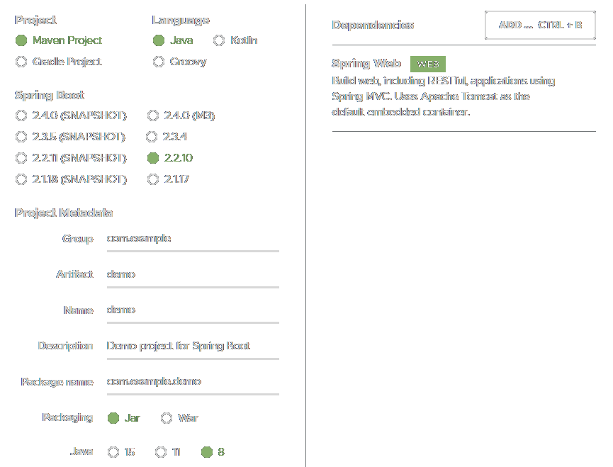

### SpringMVC

```bash
# HelloSpringMVC
ProjectName=HelloSpringMVC
mvn archetype:generate \
    "-DgroupId=org.example" \
    "-DartifactId=${ProjectName}" \
    "-DarchetypeArtifactId=maven-archetype-webapp" \
    "-DinteractiveMode=false"
cd ${ProjectName}
mkdir "src/main/java"
mkdir "src/main/webapp/WEB-INF/pages"
```

`pom.xml`

```xml
<!-- ↓↓↓↓↓↓ 添加依赖 ↓↓↓↓↓↓ -->
<properties>
    <maven.compiler.source>1.8</maven.compiler.source>
    <maven.compiler.target>1.8</maven.compiler.target>
    <spring.version>5.0.2.RELEASE</spring.version>
    <debug.port>8080</debug.port>
    <debug.path>/${project.artifactId}</debug.path>
</properties>

<dependencies>
    <dependency>
        <groupId>org.springframework</groupId>
        <artifactId>spring-context</artifactId>
        <version>${spring.version}</version>
    </dependency>
    <dependency>
        <groupId>org.springframework</groupId>
        <artifactId>spring-web</artifactId>
        <version>${spring.version}</version>
    </dependency>
    <dependency>
        <groupId>org.springframework</groupId>
        <artifactId>spring-webmvc</artifactId>
        <version>${spring.version}</version>
    </dependency>
    <dependency>
        <groupId>javax.servlet</groupId>
        <artifactId>javax.servlet-api</artifactId>
        <version>3.1.0</version>
        <scope>provided</scope>
    </dependency>
</dependencies>

<build>
    <plugins>
        <plugin>
            <artifactId>maven-compiler-plugin</artifactId>
            <version>2.3.2</version>
            <configuration>
                <compilerArguments>
                    <extdirs>src/main/webapp/WEB-INF/lib</extdirs>
                </compilerArguments>
            </configuration>
        </plugin>
        <plugin>
            <groupId>org.eclipse.jetty</groupId>
            <artifactId>jetty-maven-plugin</artifactId>
            <version>9.3.7.v20160115</version>
            <configuration>
                <scanIntervalSeconds>10</scanIntervalSeconds>
                <httpConnector>
                    <port>${debug.port}</port>
                </httpConnector>
                <webAppConfig>
                    <contextPath>${debug.path}</contextPath>
                </webAppConfig>
            </configuration>
        </plugin>
    </plugins>
</build>
<!-- ↑↑↑↑↑↑ 添加依赖 ↑↑↑↑↑↑ -->
```

```bash
# 运行项目
mvn jetty:run
```

`webapp/WEB-INF/web.xml`

```xml
<!DOCTYPE web-app PUBLIC
        "-//Sun Microsystems, Inc.//DTD Web Application 2.3//EN"
        "http://java.sun.com/dtd/web-app_2_3.dtd">

<web-app>
    <display-name>Archetype Created Web Application</display-name>
    <servlet>
        <servlet-name>DispatcherServlet</servlet-name>
        <servlet-class>org.springframework.web.servlet.DispatcherServlet</servlet-class>
        <init-param>
            <param-name>contextConfigLocation</param-name>
            <!-- 指定Bean配置文件：Main.xml -->
            <param-value>classpath:Main.xml</param-value>
        </init-param>
        <load-on-startup>1</load-on-startup>
    </servlet>

    <servlet-mapping>
        <servlet-name>DispatcherServlet</servlet-name>
        <url-pattern>/</url-pattern>
    </servlet-mapping>
</web-app>
```

`resources/Main.xml`

```xml
<?xml version="1.0" encoding="UTF-8"?>
<beans xmlns="http://www.springframework.org/schema/beans"
       xmlns:mvc="http://www.springframework.org/schema/mvc"
       xmlns:context="http://www.springframework.org/schema/context"
       xmlns:xsi="http://www.w3.org/2001/XMLSchema-instance"
       xsi:schemaLocation="
            http://www.springframework.org/schema/beans
                http://www.springframework.org/schema/beans/spring-beans.xsd
            http://www.springframework.org/schema/mvc
                http://www.springframework.org/schema/mvc/spring-mvc.xsd
            http://www.springframework.org/schema/context
                http://www.springframework.org/schema/context/spring-context.xsd
        ">
    <!-- 注解扫描 -->
    <context:component-scan base-package="org.example" />

    <!-- 视图解析器 -->
    <bean id="internalResourceViewResolver" class="org.springframework.web.servlet.view.InternalResourceViewResolver">
        <!-- 指定内置JSP文件位置 -->
        <property name="prefix" value="WEB-INF/pages/" />
        <property name="suffix" value=".jsp" />
    </bean>

    <!-- SpringMVC注解支持 -->
    <mvc:annotation-driven />
</beans>
```

`org.example.HelloController.java`

```java
package org.example;

import org.springframework.stereotype.Controller;
import org.springframework.web.bind.annotation.RequestMapping;
import org.springframework.ui.Model;
import javax.servlet.http.HttpServletResponse;
import java.io.IOException;

@Controller
public class HelloController {
    /**
     * 重定向页面
     */
    @RequestMapping(path = "/")
    public void root(HttpServletResponse response) throws IOException {
        response.sendRedirect("./index.jsp");
    }

    /**
     * 绑定内置JSP页面
     */
    @RequestMapping(path = "/hello")
    public String demo_hello(Model model) {
        // 在接下来的页面中可以使用的引用
        model.addAttribute("hi", new String("This is 'hello' !"));
        // 重定向到 WEB-INF/pages/hello.jsp
        return "hello";
    }
}
```

`webapp/index.jsp`

```html
<%@ page contentType="text/html;charset=UTF-8" language="java" %>
<html>
<head><title>Index</title></head>
<body><A href="hello">Hello</A></body>
</html>
```

`webapp/WEB-INF/pages/hello.jsp`

```html
<%@ page contentType="text/html;charset=UTF-8" language="java" isELIgnored="false" %>
<html>
<head><title>hello.jsp</title></head>
<body>${hi}</body>
</html>
```

### SpringBoot

登录[Spring Initializr](https://start.spring.io/)下载一个项目模板。



`HelloController.java`

```java
package com.example.demo.controller;

import org.springframework.web.bind.annotation.GetMapping;
import org.springframework.web.bind.annotation.PostMapping;
import org.springframework.web.bind.annotation.RestController;

import javax.servlet.http.HttpServletRequest;
import javax.servlet.http.HttpServletResponse;

@RestController
public class HelloController {

    @GetMapping("/hello")
    public String getHello(HttpServletRequest request, HttpServletResponse response) {
        System.out.println(request.getHeader("User-Agent"));
        response.setHeader("MyHeader", "Get");
        return "Hello";
    }

    @PostMapping("/hello")
    public String postHello(HttpServletRequest request, HttpServletResponse response) {
        System.out.println(request.getHeader("User-Agent"));
        response.setHeader("MyHeader", "Post");
        return "Hello";
    }

}
```

```batch
mvn package
start http://127.0.0.1:8080/hello
@FOR /F "usebackq" %f in (`DIR /B "target\*.war"`) DO java -jar "target/%f"
```
